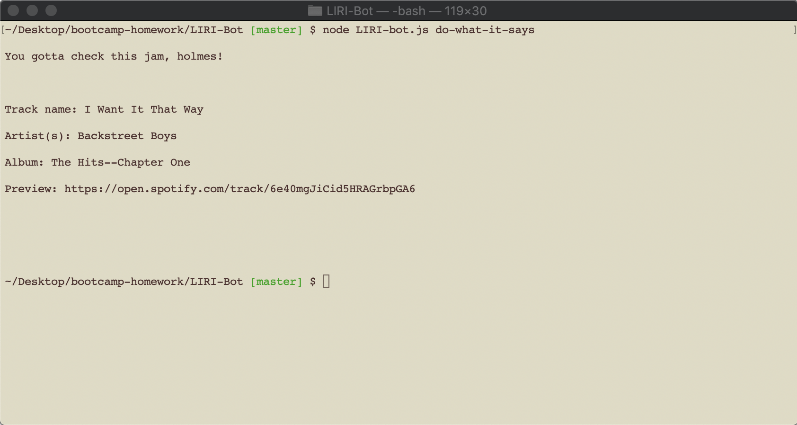

# LIRI-Bot

# Summary

LIRI-Bot is like iPhone's SIRI. However, while SIRI is a Speech Interpretation and Recognition Interface, LIRI is a Language Interpretation and Recognition Interface. LIRI-Bot is a command line node app that takes in parameters ('spotify-this', 'movie-this', 'concert-this', and 'do-what-it-says'), and gives the user back data in the terminal.

## Technology

LIRI runs her one-person operation solely from her humble abode in the command line. Assisting LIRI are her good friends Inquirer, Axios, Dotenv, Sptify-Node-API, Moment.js, FileSystem, and two web API's - BandsInTown and the Online Movie Database (OMDB). 

Axios is used to make requests and retrieve responses for the web API's, Moment.js is used to convert the date and time of upcoming concerts to a prettier format, while FileSystem and Dotenv provide support behind the scenes.

Take a look at LIRI in action below!

<!-- gifs here -->
### Go LIRI, Go!

#### Here is LIRI performing a movie search:

Isn't she wonderful?!

#### Here is LIRI performing a concert search:

Isn't she breathtaking?!

#### Here is LIRI performing a Spotify search:

Isn't she heartwrenchingly fantastic?!

#### Here is LIRI doing what it says:

Isn't she just drop-dead gorgeous?!

## Current State

The generator is fully functional and displays correct and digestable information, but LIRI could definitely use a bit of a makeover. The goal is to at some point personalize LIRI's narrative with Inquirer, 

## License
[MIT](https://choosealicense.com/licenses/mit/)
